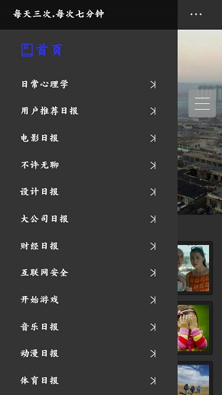

## start
---

### git clone 
### cd <file>
### npm install
### node server/bin/www.js 启动开发依赖的服务器
### npm start 开始编译
### 等待浏览器自己打开...编译的过程很慢(webpack新手)

## tec
-------------

- react        
- react-dom     
- react-router-dom     
- redux    
- react-redux     
- redux-saga     

## res

=========================

**个人开发学习之用**    
**代码中仍有不少坑,只是练手**